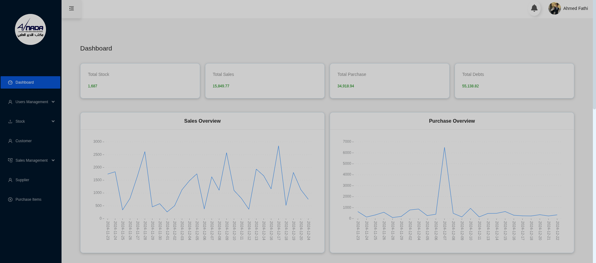

# 📦 Al Nada Manager App

A **full-stack sales and inventory management system** built for **Al Nada Scientific Office** to streamline management of products, sales, purchases, suppliers, customers, and debts.  
Designed for efficiency and scalability, this app empowers the business to track operations in real time.

---

## 🚀 Tech Stack

- **Frontend:** React.js, Redux  
- **Backend:** Express.js (Node.js)  
- **Database:** PostgreSQL  

---

## 📌 Features

- **Inventory Management:** Add, edit, delete, and track products.  
- **Sales Management:** Record and monitor sales transactions.  
- **Purchases Tracking:** Log and manage purchases from suppliers.  
- **Customer & Supplier Management:** Maintain detailed contact records.  
- **Debt Tracking:** Record outstanding amounts and payment history.  
- **Search & Filtering:** Quickly find products, customers, or suppliers.  
- **Real-time Data Updates:** Powered by Redux for smooth state management.


---

## 🖼 Screenshots


### Dashboard


### Customers Page


---

## 📂 Project Structure

```plaintext
al-nada-manager-app/
│
├── Frontend/           # React frontend
├── Backend/           # Express backend
├── Data.sql           # PostgreSQL migrations / queries
├── screenshots/      # App screenshots
└── README.md
```

---

## ⚙️ Installation & Setup

### 1️⃣ Clone the repository
```bash
git clone https://github.com/your-username/al-nada-manager-app.git
cd al-nada-manager-app
```

### 2️⃣ Install dependencies
**Backend**
```bash
cd Backend
npm install
```

**Frontend**
```bash
cd Frontend
npm install
```

### 4️⃣ Run the application
**Backend**
```bash
cd Backend
npm run dev
```

**Frontend**
```bash
cd Frontend
npm run dev
```

---

## 📜 License
This project is licensed under the [MIT License](LICENSE).

---

## ✨ Author
**Ahmed Fathi**  
GitHub: [ahmedfathy0-0](https://github.com/ahmedfathy0-0)